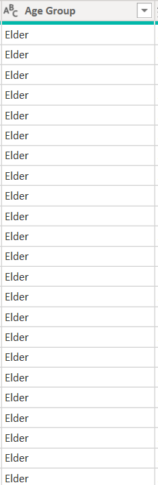
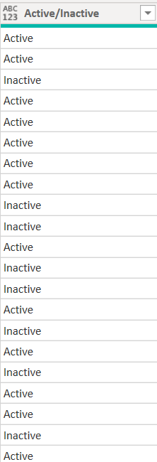
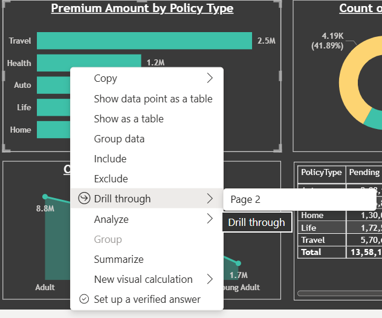
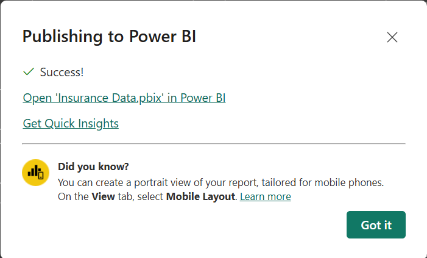
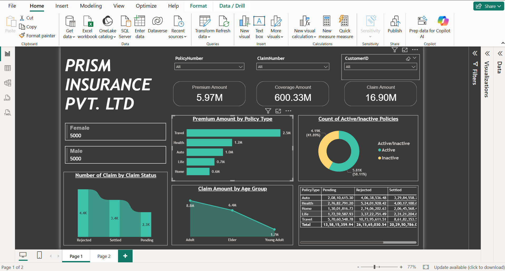
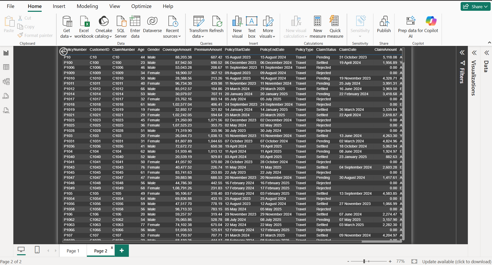
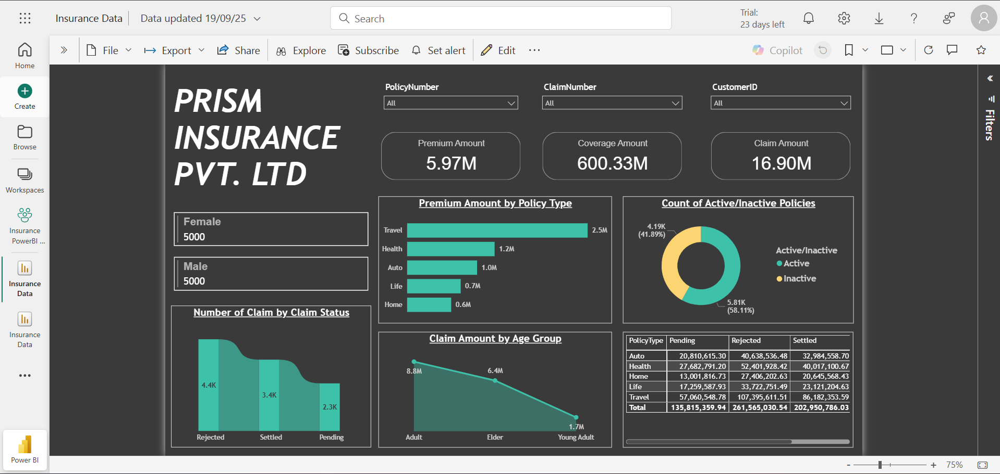
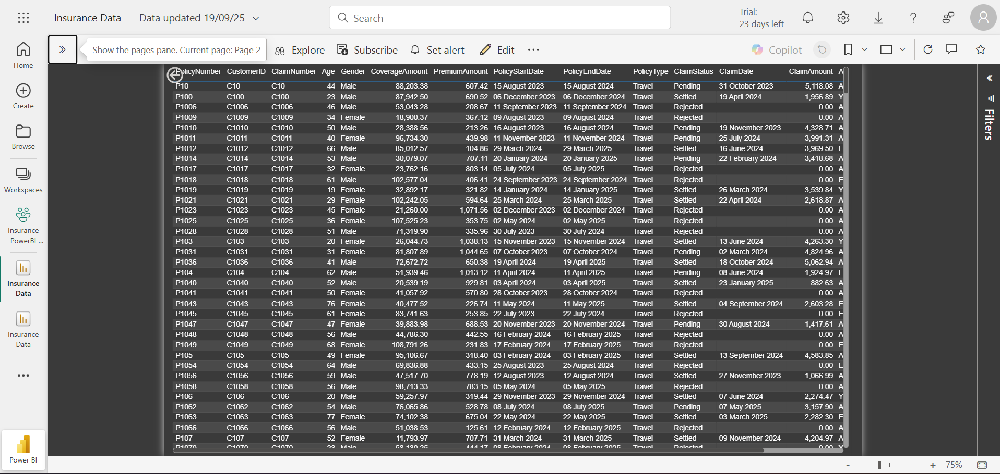

# Insurance-Data-Dashboard
### Dashboard Link :https://app.powerbi.com/links/LeUeLtc6Ta?ctid=a3d2d61d-5751-4b5f-ba05-aec2aeca6ec8&pbi_source=linkShare&bookmarkGuid=5517c014-1f85-4d30-ba3b-0397b1c2b903
---
## Problem Statement

The insurance sector generates large volumes of customer and policy data, but without proper analysis, key insights remain hidden. This dashboard provides a consolidated view of insurance data that helps stakeholders:

- Understand customer distribution and policy trends.

- Monitor claims and revenue performance.

- Identify improvement areas in services through drill-through analysis and slicer-based filtering.

By creating an interactive and visually appealing dashboard, business leaders can make data-driven decisions regarding policies, claims handling, and customer satisfaction.

### Steps Followed

- Step 1 : Connected MS SQL Server database to Power BI Desktop and imported the required dataset.

- Step 2 : Performed data profiling in Power Query Editor by enabling column distribution, column quality, and column profile. Ensured profiling was done on the entire dataset.

- Step 3 : Checked for null and duplicate values. Minor missing values were ignored since they represented less than 1% of the dataset.

- Step 4 : Applied transformations where necessary and ensured proper data types were assigned.

- Step 5 : Added slicers for filtering by:

        Policy Type

        Customer Age Group

        Claim Status

- Step 6 : Designed card visuals to represent KPIs like:

        Total Customers

        Total Premium Amount

        Total Claims Processed

- Step 7 : Calculated conditional column in which, customers were grouped into various age groups.

    for creating new column following DAX expression was written;
       
        Age Group = if [Age] <= 24 then "Young Adult" 
        else if [Age] <= 60 then "Adult" 
        else "Elder"
        
    

- Step 8 : Calculated conditional column in which, active/inactive policy was given as per the policy end date
    for creating new column following expression was written;

        Active/Inactive = if [PolicyEndDate] <= #date(2024, 12, 10) then "Inactive" 
        else "Active"
    

- Step 9 : Created bar chart to show claim distribution by region and policy type.

- Step 10 : Added matrix visual to view customer-policy-claim relationship in a structured format.

- Step 11 : Enabled drill-through filter to move from high-level KPIs to detailed policy or customer-level insights.

- Step 12 : Applied consistent theme and formatted visuals for professional presentation.

- Step 13 : Published report to Power BI Service for sharing and accessibility.
  

---

# Snapshot of Dashboard
## Power BI Desktop View

### Page 1:

### Page 2:

## Power BI Service View

### Page 1:

### Page 2:

---
# Insights

Following inferences can be drawn from the dashboard:

[1] Key Business Metrics

    Premium Amount = ₹5.97M

    Coverage Amount = ₹600.33M

    Claim Amount = ₹16.90M

These KPIs act as the company’s financial heartbeat.

[2] Gender Insights

    Male Policyholders = 5,000

    Female Policyholders = 5,000

Balanced distribution → Equal opportunity for targeted campaigns.

[3] Claims Analysis

    Claims Rejected = 4.4K

    Claims Settled = 3.4K

    Claims Pending = 2.3K

Too many pending claims may indicate inefficiency, while too many rejections may reduce customer trust.

[4] Premium & Policy Insights

    Travel Insurance leads in Premiums = ₹2.5M

58% Active vs 42% Inactive policies means Customer retention is a challenge.

[5] Claim Amount by Age Group

    Adults = ₹8.8M (highest claims)

    Elders = ₹6.4M

    Young Adults = ₹1.7M

Insight: Risk increases with age, can guide premium pricing.

[6] Financial Summary

    Travel Insurance = Highest rejected claims (~₹10M).

    Health Insurance = Highest settled claims (~₹4M).

This shows which products are profitable vs. risky.

---
# Conclusion

The Insurance Dashboard provides a 360-degree view of customer, policy, and claims data. It enables insurers to:

- Improve claim settlement efficiency.

- Target underperforming regions.

- Identify high-value customers.

- Optimize policy offerings based on customer demographics.

This report acts as a strategic decision-making tool, ensuring business growth through data-driven insights.

---
Author - Rajat Singh
B.Tech - Computer Science and Engineering | AI & Data Enthusiast
Email : rajattsingh10@gmail.com | LinkedIn : https://www.linkedin.com/in/rajat-singh-bb941924a/
